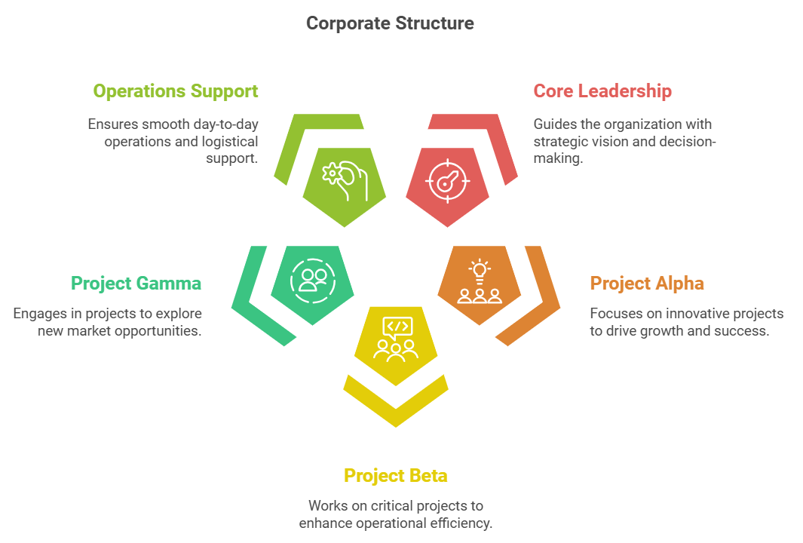
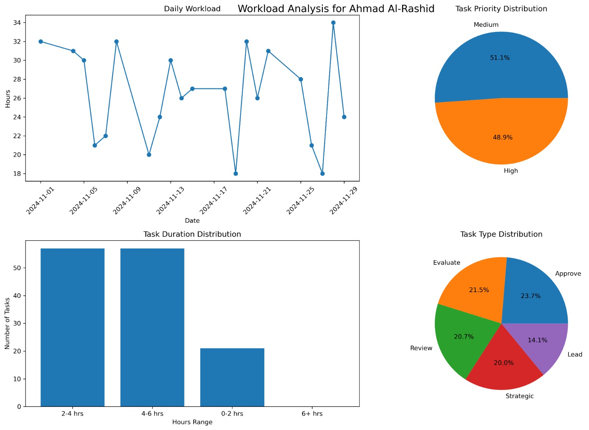
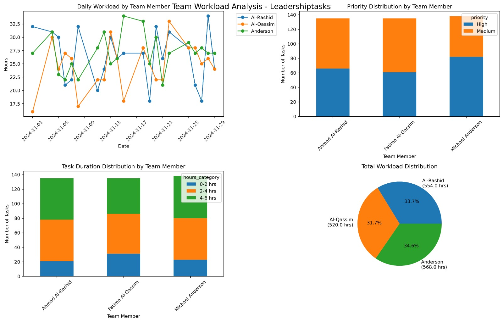
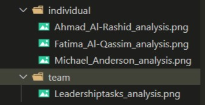
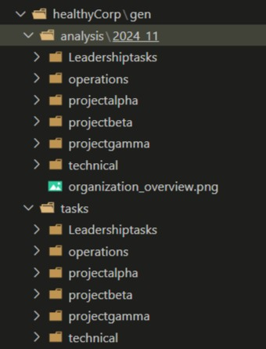

# HealthyCorp : Quantitative Framework for Organizational Mental Health Analysis

## 📋 Overview
HealthyCorp is a comprehensive framework that quantifies organizational mental health through advanced communication analysis and sociometric visualization. The project combines NLP-based micro-level analysis with macro-level organizational health metrics to produce actionable insights for corporate wellbeing.

## 📚 Introduction / problematic
We began by understanding the Critical Role of Mental Health in Corporate Success and Organizational Sustainability and the importance of quantifying organizational health from Traditional Metrics to Digital Communication Analysis.
We then explained the problematic at hand and the complex dynamics of professional communication.

## 🎯 Approach 
Moving beyond traditional sentiment analysis, we propose a refined ten-class sys-
tem specifically designed for professional communications. These classes are derived
from extensive analysis of workplace interaction patterns and organizational behavior
research.

=> To test and validate our framework, we constructed a hypothetical corporate setting
consisting of **20 employees across six teams: Core Leadership, Project Alpha, Project
Beta, Project Gamma, Operations Support, and Technical Support.** Each employee
is assigned a primary cognitive profile based on their communication patterns across
the ten sentiment classes.

We generated tasks for each team member using JSON files following this structure: { "date": "", "task": "", "priority": "", "estimated_hours": }. 
These tasks were then analyzed to study individual workloads and overall team dynamics, helping understand resource allocation and team interactions.

=> We then did a profound Sociometric Analysis Framework where we proposed a method to calculate the key relationships ( after creating the cognitive profiles for each employee). We used a proposed method after checking out other methods and criticizing said methods. (Granovetter’s theory and Moreno’s sociometry theory)

## Creation of a data pipeline and interfacing:

Development of a Flink system for data standardization (20%)
Development of a Kafka system for data streaming (95%)
Development of a Schema Registry system to ensure data validity (95%)
Development of a raw data backup system (20%)
Development of a basic Spark system (30%)
Development of a PostgreSQL database to store processed data (50%)
Development of a web interface and a simple backend for data visualization (60%)
Integration of molecular systems (35%)

All theories and discussions are in the article ( provided in the repo) [Link Text](https://github.com/AmineF0/healthyCorp/blob/main/HealthyCorp%20Article.pdf)
